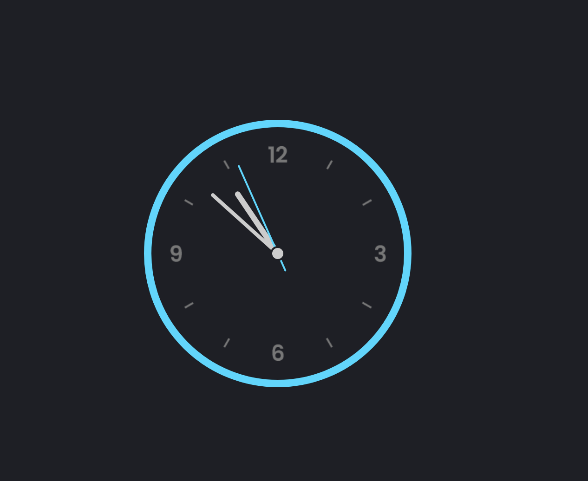

<h3>Clocks are instruments that measure and show the time. An analogue clock is a clock or watch that has moving hands and (usually) hours marked from 1 to 12 to show you the time.</h3>

<h5>HTML, CSS and JavaScript were combined in the project.</h5>

